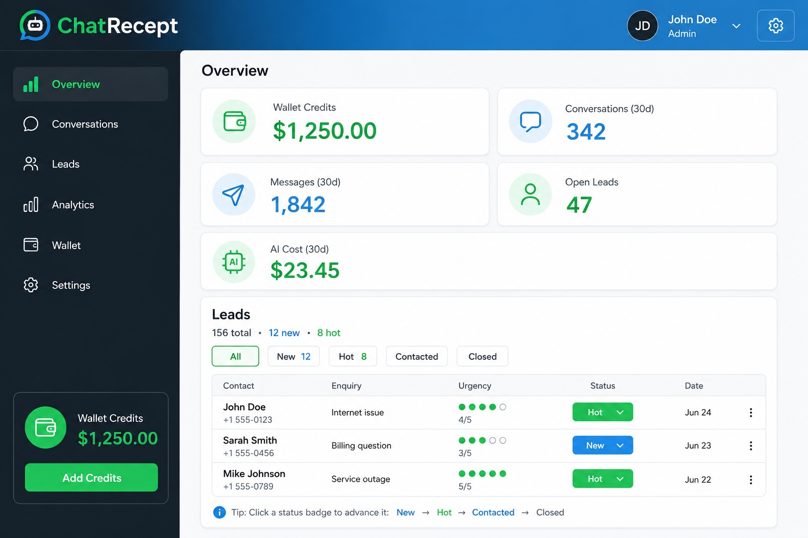
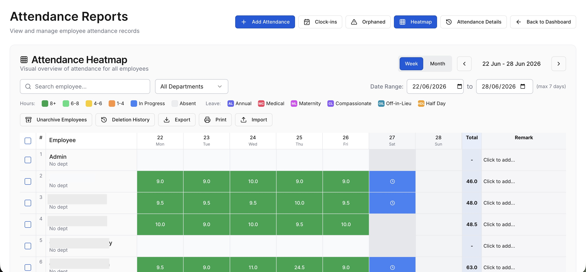

# 🖼️ Image Placeholders - Ready for Upload

All HTML files now have image placeholders in place. These will automatically load images when you upload them to the correct directories.

---

## 📍 Image Placeholder Locations

### Homepage (index.html)

#### ChatRecept Splash Image
```html

```
- **Expected File:** `images/projects/splash/chatrecept-dashboard.jpg`
- **Size:** 1200×675px or 1920×1080px
- **Location on Page:** Large featured card (top left)

#### NexaMatrix Splash Image
```html

```
- **Expected File:** `images/projects/splash/nexamatrix-heatmap.jpg`
- **Size:** 1200×675px or 1920×1080px
- **Location on Page:** Medium card (top right)

#### KhunCaddy Splash Image
```html

```
- **Expected File:** `images/projects/splash/khuncaddy-marketplace.jpg`
- **Size:** 1200×675px or 1920×1080px
- **Location on Page:** Dark card (bottom right)

---

### Projects Page (projects.html)

#### ChatRecept Detail Image
```html

```
- **Expected File:** `images/projects/chatrecept/chatrecept-01-dashboard.jpg`
- **Size:** 1920×1080px or 1200×800px
- **Location on Page:** ChatRecept project section (right side)

#### NexaMatrix Detail Image
```html

```
- **Expected File:** `images/projects/nexamatrix/nexamatrix-01-heatmap.jpg`
- **Size:** 1920×1080px or 1200×800px
- **Location on Page:** NexaMatrix project section (left side)

#### KhunCaddy Detail Image
```html

```
- **Expected File:** `images/projects/khuncaddy/khuncaddy-01-marketplace.jpg`
- **Size:** 1920×1080px or 1200×800px
- **Location on Page:** KhunCaddy project section (right side)

---

## 📂 Required Directory Structure

Create these directories and upload images:

```
jclabs/
└── images/
    └── projects/
        ├── splash/
        │   ├── chatrecept-dashboard.jpg
        │   ├── nexamatrix-heatmap.jpg
        │   └── khuncaddy-marketplace.jpg
        ├── chatrecept/
        │   ├── chatrecept-01-dashboard.jpg
        │   ├── chatrecept-02-conversation.jpg
        │   ├── chatrecept-03-lead-scoring.jpg
        │   ├── chatrecept-04-analytics.jpg
        │   ├── chatrecept-05-websitebot.jpg
        │   └── chatrecept-06-mobile.jpg
        ├── nexamatrix/
        │   ├── nexamatrix-01-heatmap.jpg
        │   ├── nexamatrix-02-location-login.jpg
        │   ├── nexamatrix-03-clockin.jpg
        │   ├── nexamatrix-04-leave.jpg
        │   ├── nexamatrix-05-payroll.jpg
        │   ├── nexamatrix-06-analytics.jpg
        │   └── nexamatrix-07-mobile.jpg
        └── khuncaddy/
            ├── khuncaddy-01-marketplace.jpg
            ├── khuncaddy-02-verification.jpg
            ├── khuncaddy-03-profile.jpg
            ├── khuncaddy-04-chat.jpg
            ├── khuncaddy-05-telegram-login.jpg
            ├── khuncaddy-06-payment.jpg
            ├── khuncaddy-07-ratings-tiers.jpg
            └── khuncaddy-08-mobile.jpg
```

---

## 🔧 How Image Loading Works

The images are set to `opacity-0` (invisible) by default because they serve as background images. When you upload the actual images:

1. **Images will load invisibly** (opacity-0 hides them)
2. **The icon and text will remain visible** on top
3. **When zoomed in on mobile**, the subtle background image adds visual depth

This design allows the page to display properly with or without images while providing a subtle visual enhancement when images are present.

---

## ✅ Upload Checklist

### Before Uploading Images:

1. **Create directory structure**
   ```bash
   mkdir -p images/projects/{splash,chatrecept,nexamatrix,khuncaddy}
   ```

2. **Use exact filenames** from the list above

3. **Verify dimensions:**
   - Splash: 1200×675px or 1920×1080px
   - Detail: 1920×1080px or 1200×800px
   - Mobile: 375×667px or 1080×1920px

4. **Compress images:**
   - Use TinyPNG: https://tinypng.com
   - Keep splash <400KB
   - Keep detail <500KB
   - Keep mobile <300KB

5. **Upload to correct locations:**
   ```
   chatrecept-dashboard.jpg → images/projects/splash/
   chatrecept-01-dashboard.jpg → images/projects/chatrecept/
   nexamatrix-01-heatmap.jpg → images/projects/nexamatrix/
   khuncaddy-01-marketplace.jpg → images/projects/khuncaddy/
   (etc.)
   ```

6. **Test loading:**
   - Open homepage in browser
   - Check Projects page
   - Test on mobile
   - Verify all images load

---

## 🖼️ Current Placeholders

These images already have placeholders ready:

**Homepage (index.html):**
- ✅ ChatRecept splash (line ~160)
- ✅ NexaMatrix splash (line ~209)
- ✅ KhunCaddy splash (line ~229)

**Projects Page (projects.html):**
- ✅ ChatRecept detail (line ~198)
- ✅ NexaMatrix detail (line ~308)
- ✅ KhunCaddy detail (line ~410)

---

## 📋 Next Steps

1. **Capture images** following MASTER_IMAGES_LIST.md
2. **Compress with TinyPNG**
3. **Create directory structure** shown above
4. **Upload images** with exact filenames
5. **Test in browser** to verify loading
6. **Deploy** when ready

---

## 💡 Pro Tips

- Images will load automatically when you place them in the correct directories
- The alt text will display if images fail to load
- Icons remain visible regardless of image status
- Start with the 3 splash images (homepage) for immediate visual impact

---

**Status:** ✅ Placeholders in place, ready for images  
**Last Updated:** 2026-06-18  
**Next Action:** Upload images to directories
